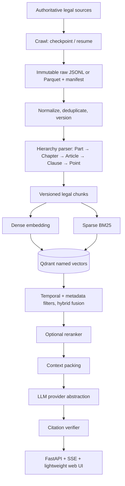

# Vietnamese Legal Assistant | Trợ lý Pháp luật Việt Nam

> **Hierarchy-aware + temporal-aware hybrid RAG + verifiable citations + measured evaluation.**
>
> **Hybrid RAG nhận biết cấu trúc và hiệu lực theo thời gian, citation có thể kiểm chứng, evaluation tái lập được.**

## Status | Trạng thái

**Architecture and agent-workflow foundation.** This repository currently contains the proposed architecture and project workflows. It does **not** yet contain a crawler, API, index, Docker Compose configuration, or published benchmark. Roadmap items and target commands are not implementation claims.

**Nền tảng kiến trúc và workflow cho agent.** Repository hiện chứa kiến trúc và workflow đề xuất; **chưa** có crawler, API, index, Docker Compose hay benchmark công bố. Roadmap không phải là claim rằng tính năng đã chạy.

## Purpose | Mục tiêu

An end-to-end Vietnamese legal **research** assistant: authoritative-source ingestion → legal parsing → hybrid retrieval → grounded generation → citation verification → evaluation → API → Docker → CI. It is not a legal-advice service.

Trợ lý **nghiên cứu** pháp luật Việt Nam end-to-end: ingest nguồn có thẩm quyền → parse pháp lý → hybrid retrieval → grounded generation → kiểm tra citation → evaluation → API → Docker → CI. Đây không phải dịch vụ tư vấn pháp lý.

### Legal notice | Lưu ý pháp lý

Answers must use only retrieved authoritative evidence, display source identity and available Điều/Khoản/Điểm, state uncertainty, and abstain when evidence is insufficient. The user should verify the original source and seek qualified legal counsel when needed.

Câu trả lời chỉ được dùng evidence có thẩm quyền đã retrieve, hiển thị nguồn và Điều/Khoản/Điểm khi có, nêu uncertainty, và từ chối khi evidence không đủ. Người dùng cần đối chiếu nguồn gốc và hỏi chuyên gia pháp lý khi cần.

## Why this project | Điểm khác biệt

```text
Vietnamese Legal Assistant
  = hierarchy-aware chunking
  + temporal-aware hybrid retrieval (dense + BM25 + fusion)
  + grounded answers with citation audit
  + reproducible evaluation
```

A legally related passage is not automatically a valid basis. The relevant document version, legal hierarchy, effective period, and claim-level support all matter.

Một đoạn cùng chủ đề pháp lý chưa chắc là căn cứ hợp lệ. Phiên bản văn bản, hierarchy, thời gian hiệu lực và mức độ support cho từng claim đều quan trọng.

## Target architecture | Kiến trúc mục tiêu



### Query path | Luồng truy vấn

1. Normalize the query and resolve `as_of_date` (today by default, or a date the user requests).
2. Run dense and sparse retrieval with the same legal and temporal policy.
3. Fuse candidates, optionally rerank only when a benchmark justifies cost and latency.
4. Pack context retaining source URL, document, article, clause, point, and effective status.
5. Generate only from packed context; verify every citation before returning it.

1. Chuẩn hóa query và xác định `as_of_date`.
2. Chạy dense/sparse retrieval với cùng chính sách pháp lý và thời gian.
3. Fuse candidate; chỉ rerank nếu benchmark chứng minh đáng đổi latency/chi phí.
4. Pack context giữ URL, văn bản, Điều/Khoản/Điểm và trạng thái hiệu lực.
5. Chỉ sinh từ context; xác minh citation trước khi trả lời.

## Data integrity | Toàn vẹn dữ liệu

| Principle | Requirement |
|---|---|
| Provenance | Preserve source identifier/URL, crawl time, content hash, source response and failures. |
| Raw data | Immutable; normalized data and indexes are versioned derivatives. |
| History | Retain active, future, partially expired, and expired legal documents. |
| Hierarchy | Preserve document → part → chapter → section → article → clause → point. |
| Uncertainty | Keep literal source text and a review state; never guess citations, dates, or status. |

| Nguyên tắc | Yêu cầu |
|---|---|
| Provenance | Lưu source ID/URL, thời điểm crawl, content hash, response và lỗi. |
| Raw data | Bất biến; dữ liệu normalize/index là artifact dẫn xuất có version. |
| Lịch sử | Giữ active, future, partially expired và expired document. |
| Hierarchy | Giữ văn bản → Phần → Chương → Mục → Điều → Khoản → Điểm. |
| Uncertainty | Giữ text nguồn/review state; không đoán citation, ngày hay status. |

```python
class LegalChunk(BaseModel):
    chunk_id: str
    document_id: str
    part: str | None
    chapter: str | None
    article: str | None
    clause: str | None
    point: str | None
    content: str
    effective_from: date | None
    effective_to: date | None
    effective_status: str
    source_url: str
```

A long provision may be split into ordered subparts, but it must retain the exact verified parent path. Malformed headings are retained and flagged—not silently repaired.

Một quy định dài có thể tách thành subpart có thứ tự, nhưng phải giữ parent path đã xác minh. Heading lỗi phải được giữ và đánh dấu—không tự sửa.

## Hybrid retrieval | Hybrid retrieval

Qdrant's Query API supports `prefetch` over named dense/sparse vectors and server-side fusion. RRF is the initial safe default because it combines ranks rather than raw cosine and BM25 scores on incompatible scales. Any choice of RRF, weighted RRF, DBSF, reranker, or filter must be determined with a frozen evaluation set. [Qdrant hybrid queries](https://qdrant.tech/documentation/search/hybrid-queries/)

Query API của Qdrant hỗ trợ `prefetch` cho named dense/sparse vector và fusion phía server. RRF là default ban đầu an toàn vì kết hợp rank thay vì cộng raw cosine/BM25 khác thang đo. RRF có trọng số, DBSF, reranker và filter phải được quyết định qua eval set cố định. [Qdrant hybrid queries](https://qdrant.tech/documentation/search/hybrid-queries/)

```python
# Target shape; not implemented yet.
client.query_points(
    collection_name="legal_chunks",
    prefetch=[
        models.Prefetch(query=dense_vector, using="dense", limit=30, filter=temporal_filter),
        models.Prefetch(query=sparse_vector, using="sparse", limit=30, filter=temporal_filter),
    ],
    query=models.FusionQuery(fusion=models.Fusion.RRF),
    limit=10,
)
```

## Citation audit | Kiểm tra citation

For each claim/citation pair, the system must verify:

1. the authoritative source was retrieved and its identity matches;
2. the cited document/article/clause/point exists in the parsed hierarchy;
3. the cited text supports the actual claim—not merely the topic;
4. the provision applies to `as_of_date`, or historical status is disclosed.

Any failed check returns a visible **insufficient-evidence** result or removes the unsupported claim. The system must never repair a citation by guessing a nearby provision.

Nếu một bước thất bại, hệ thống trả về **insufficient evidence** rõ ràng hoặc bỏ claim không được hỗ trợ. Không được sửa citation bằng cách đoán điều khoản gần đó.

## Evaluation | Đánh giá

| Layer | Metrics |
|---|---|
| Retrieval | Recall@5/10/20, MRR, NDCG, Hit Rate, p50/p95 latency, error rate |
| Generation | RAGAS faithfulness, answer relevancy, context precision, context recall |
| Legal audit | Citation validity/precision/recall, hierarchy correctness, evidence support, abstention accuracy |

RAGAS evaluates RAG workflows but does not replace deterministic hierarchy and citation checks. [RAGAS documentation](https://docs.ragas.io/en/latest/concepts/metrics/available_metrics/)

RAGAS hỗ trợ đo RAG workflow, nhưng không thay thế kiểm tra hierarchy/citation có tính xác định. [Tài liệu RAGAS](https://docs.ragas.io/en/latest/concepts/metrics/available_metrics/)

Every report must record dataset/split, corpus/index version, embedding version/dimension, Qdrant version, generation/judge configuration, latency, cost, and failures. Tune only on development/validation data; sealed or evaluation-only test data must not guide model, prompt, or threshold choices.

Mọi report phải ghi dataset/split, corpus/index version, embedding version/dimension, Qdrant version, generation/judge config, latency, chi phí và lỗi. Chỉ tune ở development/validation; test sealed/evaluation-only không được dùng chọn model, prompt hay threshold.

### Data and research references | Dataset và nghiên cứu

- **ALQAC**: yearly Vietnamese legal retrieval/QA resources. ALQAC 2025 has Legal Document Retrieval and Legal QA tasks; confirm release terms before use or redistribution. [Competition](https://sites.google.com/view/alqac-2025/home) · [dataset repository](https://huggingface.co/datasets/nguyenlab/ALQAC)
- **Zalo Legal Text Retrieval**: widely used legal IR corpus; treat public mirrors as benchmark resources and check upstream terms. [Legal-Corpus-Zalo](https://huggingface.co/datasets/NghiemAbe/Legal-Corpus-Zalo)
- **Domain embedding baseline**: `bqbbao6/vietnamese-legal-embedding` is a 768-dimensional E5-style Vietnamese legal retriever. Follow its query/passage prefix guidance and reproduce model-card numbers independently. [Model card](https://huggingface.co/bqbbao6/vietnamese-legal-embedding)
- **Reliability motivation**: legal-RAG hallucination research supports citation verification and abstention, not a claim that either eliminates error. [Magesh et al.](https://arxiv.org/abs/2405.20362)
- **Architecture references**: existing projects combine hybrid retrieval, reranking, and citations; use their designs as references, not their reported performance as this project's results. [LexCompanion](https://github.com/danialtranz/LexCompanion) · [vn-legal-rag](https://github.com/hienlh/vn-legal-rag)

| Variant | Dataset/split | Index + embedding | Recall@10 | MRR | NDCG | Faithfulness | p95 |
|---|---|---|---:|---:|---:|---:|---:|
| Dense baseline | Not yet run | Not yet built | — | — | — | — | — |
| Dense + BM25 + RRF | Not yet run | Not yet built | — | — | — | — | — |
| Hybrid + reranker | Not yet run | Not yet built | — | — | — | — | — |

## Planned stack | Tech stack dự kiến

| Layer | Choice |
|---|---|
| Python | Python 3.11+, `uv`, Pydantic v2 |
| API | FastAPI + Uvicorn + SSE |
| Crawl/ETL | `httpx`, lxml/BeautifulSoup, optional Playwright, JSONL/Parquet, DuckDB |
| Search | Qdrant named dense/sparse vectors with metadata filters |
| Generation | Provider abstraction; no single LLM vendor is part of retrieval logic |
| Quality | pytest, RAGAS, Ruff, Pyright/Mypy, Playwright E2E |
| Delivery | Docker, Docker Compose, GitHub Actions, structured logs |

No provider price, model version, cloud service, or benchmark value is hard-coded here; those are volatile and belong in versioned run configuration.

Không hard-code giá provider, model version, cloud service hay benchmark value trong README; chúng thay đổi và phải nằm trong run configuration có version.

## Target layout | Cấu trúc mục tiêu

```text
legal_assistant/
├── AGENTS.md
├── README.md
├── pyproject.toml
├── .env.example
├── Dockerfile
├── docker-compose.yml
├── .agents/skills/
├── src/legal_assistant/{api,config,ingestion,embeddings,retrieval,generation,rag,storage,evaluation}/
├── scripts/
├── data/{raw,processed,eval}/
└── tests/{unit,integration,e2e}/
```

## Phased delivery | Lộ trình triển khai

| Phase | Deliverable | Acceptance criterion |
|---|---|---|
| 0 | Typed schemas, fixtures, settings, local Qdrant Compose | Tests and health check work with no credentials |
| 1 | Authorized checkpointable crawl, immutable manifests, normalization | Same input/config reproduces derived records |
| 2 | Hierarchical chunks; dense and sparse baselines | Frozen retrieval report with per-query artifacts |
| 3 | RRF, temporal status policy, optional reranker experiment | Quality/latency/citation deltas against baseline |
| 4 | Provider interface, context packing, citation audit, FastAPI/SSE | Unsupported citation returns insufficient evidence |
| 5 | Docker smoke fixtures, CI regression and observability | A clean machine can run the documented local stack |

Do not start with full-corpus GraphRAG, agent swarms, OCR, or a large local LLM. First prove a small authoritative corpus and a measurable baseline.

Không bắt đầu bằng full-corpus GraphRAG, agent swarm, OCR hay local LLM lớn. Hãy chứng minh trước một corpus nhỏ có thẩm quyền và baseline đo được.

## Docker handoff | Bàn giao Docker

The target Compose stack contains `api` and `qdrant`; add `postgres` only for application metadata. It does not containerize a large model by default. A smoke test must use fixture data, wait for health checks, validate API-to-Qdrant connectivity, persistence, and one non-destructive query.

Compose mục tiêu gồm `api` và `qdrant`; chỉ thêm `postgres` cho application metadata. Mặc định không containerize model lớn. Smoke test dùng fixture, chờ health check, kiểm tra API-to-Qdrant, persistence và một query không phá hủy dữ liệu.

Deleting volumes, re-ingestion, migrations, production access, using chat-supplied credentials, image publishing, and paid API calls all require explicit authorization.

Xóa volume, re-ingest, migration, truy cập production, dùng credential trong chat, publish image và gọi API trả phí đều cần ủy quyền rõ ràng.

## Agent skills | Skills cho coding agent

| Skill | Intended workflow |
|---|---|
| `legal-data-ingestion` | Authorized crawl/sync and raw-data provenance |
| `legal-document-normalization` | Metadata, lineage, temporal fields and ambiguity |
| `legal-hierarchical-chunking` | Citation-safe article/clause/point chunks |
| `legal-rag-retrieval` | Measured dense/sparse/fusion/filter changes |
| `legal-rag-evaluation` | Leakage-safe retrieval/RAG/citation evaluation |
| `legal-citation-audit` | Claim-level source, hierarchy, applicability and support checks |
| `docker-smoke-test` | Reproducible, non-destructive Docker Compose validation |

[`AGENTS.md`](AGENTS.md) is the permanent repository policy. Skills provide repeatable workflows; they grant neither access to credentials/production nor permission for destructive re-ingestion or migrations.

[`AGENTS.md`](AGENTS.md) là policy cố định của repo. Skills chỉ là workflow lặp lại; không tự cấp quyền credential/production, destructive re-ingestion hay migration.

## Limitations | Giới hạn

- Coverage, source freshness, parsing quality, and version lineage determine answer quality.
- Citation verification reduces unsupported output; it cannot guarantee legal correctness or replace professional judgment.
- Dataset terms and licenses must be checked before crawling, redistribution, training, or evaluation.

## Contributing | Đóng góp

Keep public interfaces typed, preserve source lineage, and test new behavior. Retrieval changes require a reproducible baseline comparison. Never commit `.env`, credentials, raw production data, or unverified legal citations.

Giữ public interface có type, bảo toàn source lineage và test behavior mới. Thay đổi retrieval phải so sánh tái lập với baseline. Không commit `.env`, credential, raw production data hay legal citation chưa xác minh.